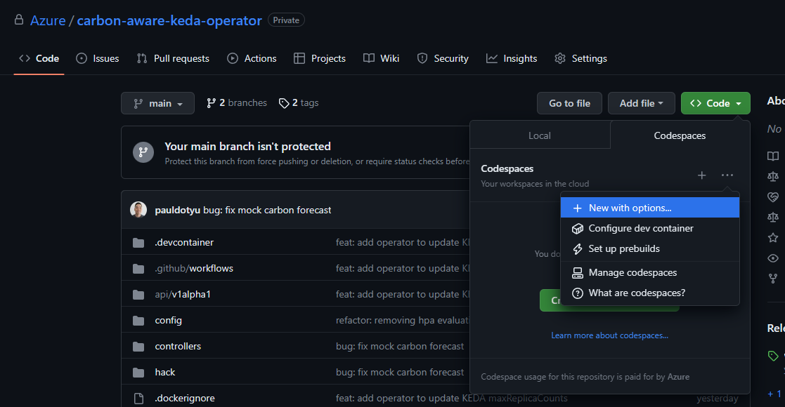
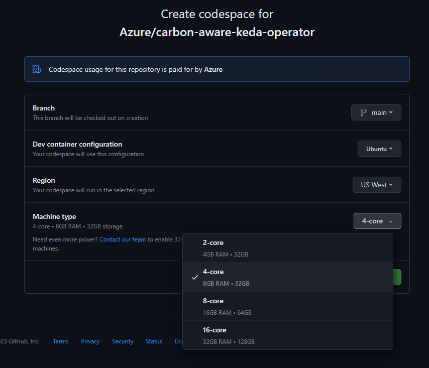
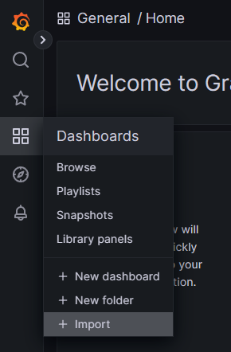
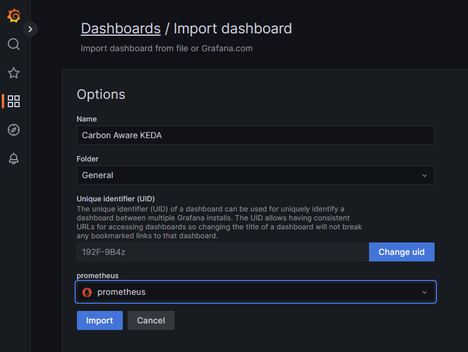
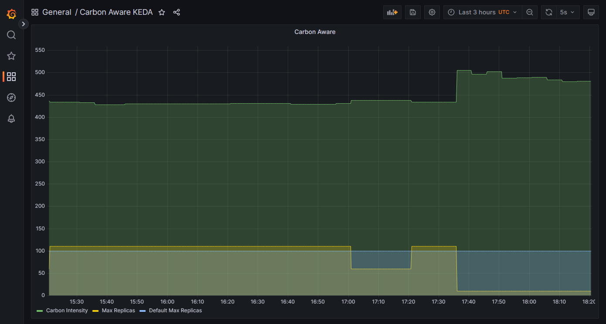

# Install with KIND in GitHub Codespaces

This repo includes [DevContainer configuration](../.devcontainer) so that you can try the operator in a [Visual Studio Code Dev Container](https://code.visualstudio.com/docs/devcontainers/containers) on your local machine or within a [GitHub Codespace](https://github.com/features/codespaces).

> To run this DevContainer on your local machine you must have Docker CLI installed.

## Create a new GitHub Codespace

Browse to the repo and click the **<> Code** button.

Make sure you click on the **Codespaces** tab and click the ellipsis on the right to open a menu. Here, you want to ensure that you are creating an appropriately sized Codespace.



Since you will be running a KIND cluster in your Codespace, you will need to size up the machine type to 4-core, 8GB RAM at minimum.



Click the **Create Codespace** button a give it a few minutes for the container to be created.

## Deploy the operator to KIND cluster

The Codespace has all the tools you need to get started. All you need to do is simply open the Terminal in VS Code and run the following command:

```bash
make kind-deploy-prom IMG=carbon-aware-keda-operator:v1
```

The command above will create a new KIND cluster and deploy the operator along with a sample workload. 

The `CarbonAwareKedaScaler` custom resource will be configured to use mock carbon intensity forecast data. If you have WattTime API credentials, you can deploy the open-source **Carbon Intensity Exporter** operator by following the instructions [here](https://github.com/Azure/kubernetes-carbon-intensity-exporter/).

> Remember to update your `CarbonAwareKedaScaler` custom resource and set the `mockCarbonForecast` property to `false`.

## Visualize the operator in action using Grafana

This operator logs custom metrics to the `/metrics` endpoint which can be scraped by Prometheus. The `kube-prometheus` stack has been deployed in the KIND cluster and configured to scrape metrics from the `carbon-aware-keda-operator-system` namespace. You will need to import the sample dashboard to Grafana.

Enable port-forwarding on the Grafana service.

```bash
kubectl port-forward svc/grafana 3000:3000 -n monitoring
```

In your web browser, navigate to http://localhost:3000/ and log in using the default username `admin` with default password `admin`. You will be prompted to create a new password.

Download the sample dashboard [here](https://github.com/Azure/carbon-aware-keda-operator/blob/main/hack/grafana/Carbon%20Aware%20KEDA-Dashboard.json).

Expand the **Dashboards** menu item and click the **+ Import** button.



Upload the **Carbon Aware KEDA-Dashboard.json** file and select **prometheus** as the data source then click Import.



You will be able to view the default max replicas, and the max replicas ceiling being raised and lowered over time based on the carbon intensity rating.



## OPTIONAL: Install Carbon Intensity Exporter Operator

To test with real data from the Carbon Aware SDK, head over to this [repo](https://github.com/Azure/kubernetes-carbon-intensity-exporter/) and follow the instructions in the [README.md](https://github.com/Azure/kubernetes-carbon-intensity-exporter/blob/main/README.md) to install the operator into the KIND cluster.

> IMPORTANT: You must have WattTime API credentials to use this operator

If you do not have WattTime API credentials you can skip this step and still test this operator using mock carbon intensity data

```bash
cd /tmp
git clone https://github.com/Azure/kubernetes-carbon-intensity-exporter.git
cd kubernetes-carbon-intensity-exporter
```

Using Helm, install the Carbon Intensity Exporter Operator into the KIND cluster.

```bash
export LOCATION=westus
export WATTTIME_USERNAME=<YOUR_USERNAME> 
export WATTTIME_PASSWORD=<YOUR_PASSWORD>

helm install carbon-intensity-exporter \
  --set carbonDataExporter.region=$LOCATION \
  --set wattTime.username=$WATTTIME_USERNAME \
  --set wattTime.password=$WATTTIME_PASSWORD \
  ./charts/carbon-intensity-exporter

# go back to repo directory
cd /workspaces/carbon-aware-keda-operator
```

Verify carbon intensity data is in place.

```bash
kubectl get cm -n kube-system carbon-intensity -o jsonpath='{.data}' | jq
```

You can view the carbon intensity values with the following command.

```bash
kubectl get cm -n kube-system carbon-intensity -o jsonpath='{.binaryData.data}' | base64 --decode | jq
```

With the carbon intensity data source updated, you will need to update the `CarbonAwareKedaScaler` custom resource to set the `mockCarbonForecast` property to `false`.

```bash
kubectl apply -f - <<EOF
apiVersion: carbonaware.kubernetes.azure.com/v1alpha1 
kind: CarbonAwareKedaScaler 
metadata: 
  labels: 
    app.kubernetes.io/name: carbonawarekedascaler 
    app.kubernetes.io/instance: carbonawarekedascaler-sample 
    app.kubernetes.io/part-of: carbon-aware-keda-operator 
    app.kubernetes.io/managed-by: kustomize 
    app.kubernetes.io/created-by: carbon-aware-keda-operator 
  name: carbon-aware-word-processor-scaler
spec: 
  kedaTarget: scaledobjects.keda.sh 
  kedaTargetRef: 
    name: word-processor-scaler
    namespace: default 
  carbonIntensityForecastDataSource:       # carbon intensity forecast data source 
    mockCarbonForecast: false              # [OPTIONAL] use mock carbon forecast data 
    localConfigMap:                        # [OPTIONAL] use configmap for carbon forecast data 
      name: carbon-intensity 
      namespace: kube-system
      key: data 
  maxReplicasByCarbonIntensity:            # array of carbon intensity values in ascending order; each threshold value represents the upper limit and previous entry represents lower limit 
    - carbonIntensityThreshold: 437        # when carbon intensity is 437 or below 
      maxReplicas: 110                     # do more 
    - carbonIntensityThreshold: 504        # when carbon intensity is >437 and <=504 
      maxReplicas: 60 
    - carbonIntensityThreshold: 571        # when carbon intensity is >504 and <=571 (and beyond) 
      maxReplicas: 10                      # do less 
  ecoModeOff:                              # [OPTIONAL] settings to override carbon awareness; can override based on high intensity duration or schedules 
    maxReplicas: 100                       # when carbon awareness is disabled, use this value 
    carbonIntensityDuration:               # [OPTIONAL] disable carbon awareness when carbon intensity is high for this length of time 
      carbonIntensityThreshold: 555        # when carbon intensity is equal to or above this value, consider it high 
      overrideEcoAfterDurationInMins: 45   # if carbon intensity is high for this many hours disable ecomode 
    customSchedule:                        # [OPTIONAL] disable carbon awareness during specified time periods 
      - startTime: "2023-04-28T16:45:00Z"  # start time in UTC 
        endTime: "2023-04-28T17:00:59Z"    # end time in UTC 
    recurringSchedule:                     # [OPTIONAL] disable carbon awareness during specified recurring time periods 
      - "* 23 * * 1-5"                     # disable every weekday from 11pm to 12am UTC 
EOF
```

## Clean up

When you are done testing, delete the resources using the following command.

```bash
kind delete cluster
```